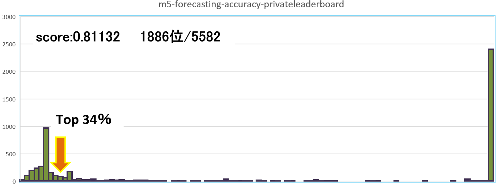

# m5-forecasting-accuracy  
[Japanese 日本語.](https://github.com/Sanaxen/m5-forecasting-accuracy/blob/master/README_jp.md).

  
Image Citation.https://www.kaggle.com/competitions/m5-forecasting-accuracy  

Kaggle Competition: M5 Forecasting - Accuracy I tried it.  

## overview
This is a hyper-multivariate time series forecasting competition using Walmart sales volume data from 2011-2016.
The competition was held from March to June 2020 and included 5558 teams from approximately 101 countries.
The competition ran from March to June 2020 and attracted 5558 teams from 101 countries, including the United States (17%), Japan (17%), India (10%), China (10%), Russia (6%), and the remaining 40% from 96 other countries.  

The competition has already concluded, with 5582 teams able to submit results in the final evaluation.  

The data provided was from a total of 10 Wal-Mart stores in the three states of California, Texas, and Wisconsin, and included data such as sales volume for 3049 different products in three categories: food, toys (HOBBIES), and household goods (HOUSEHOLD). This data is used to project the sales volume of each product category four weeks (28 days) after the last day of the data period.

The csv file is  
**calendar.csv** - Daily sales volume for each store and each product category for the past 5 years.  
Dates of religious, sporting, and other events, and SNAP (federal Supplemental Nutrition Assistance Program) availability.
*SNAP The largest federal nutrition assistance program, providing benefits to eligible low-income individuals and families through electronic benefit cards.

**sell_prices.csv** - Daily sales prices by store and by product.  
**sales_train_validation.csv** - Historical daily sales unit data by product and store  
**sales_train_evaluation.csv** - historical daily sales unit data by product and store  
**sample_submission.csv** - Template for submission  

We decided not to use sales_train_validation.csv because the competition is closed.
This is because the answer (sales_train_evaluation.csv) has already been published.  

The contest is divided into two phases: public (verification phase) and private (evaluation phase). The reveal phase was the evaluation phase, and the published correct answers were published one month before the end of the competition. The private phase is the evaluation phase, and if correctly evaluated, we will conduct predictions for an additional 4 weeks (28 days).

**public (Validation Phase)**  
Based on 5 years of sales data from January 29, 2011 to April 24, 2016, we forecast sales (sales volume) for the next 4 weeks (April 25 to May 22, 2016).  

**private (Evaluation Phase)** 
The Evaluation Phase will begin on June 1, 2020, and the sales volume from April 25 to May 22, 2016 will be made public to forecast the sales volume for the next four weeks (May 23 to June 19, 2016).  

We used the provided data as-is to make predictions.  

I used **xgboost**    
```
booster = "gbtree"  
tree_method='hist'  
objective = "reg:tweedie"  
eta = 0.02  
min_child_weight = 1  
gamma = 0  
max_depth=7  
num_iterations = 10000  
early_stopping_round = 2000  
```
Results are as follows.  
  

Only the following characteristic quantities were added because the results were not good.
Sales volume over the past 28 days, the mean and standard deviation of sales volume over the past 28 days, and the mean and standard deviation of sales volume over the past 60 days.
Sales volume over the past 60 days, the mean and standard deviation of sales volume over the past 60 days.

Results are as follows.  
  
  

If the score is narrowed down to 1.0 or less.  
  

```
#[4482]  train-rmse:2.258301     eval-rmse:2.211731 score 0.57637
#Stopping. Best iteration:
#[2482]  train-rmse:2.318164     eval-rmse:2.193691
```
