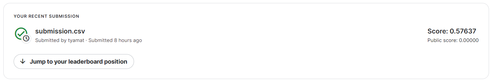
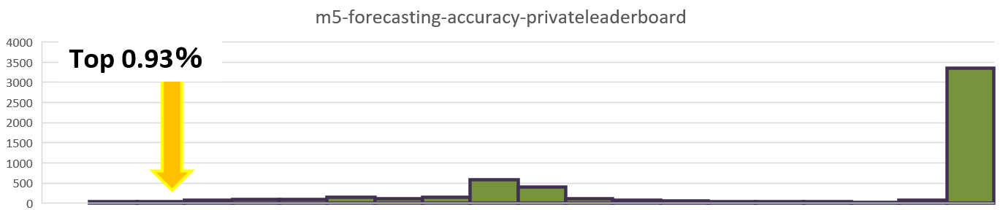

Kaggleコンペ：M5 Forecasting - Accuracy　やってみました。

  
画像引用）https://www.kaggle.com/competitions/m5-forecasting-accuracy

**概要**
Walmartの2011年?2016年の売上個数データを使って販売数量を予測コンペで超多変量時系列予測になります。
2020年3月から6月に開催され約１０１ヵ国５５５８のチームが参加。
米国 (17%)、日本 (17%)、インド (10%)、中国 (10%)、ロシア (6%)、残りの 40% はその他の 96 か国からの参加ということらしいです。

既にコンペは終了していて最終評価で結果を提出できたチームは５５８２チームでした。

提供されるデータは米国3州（カリフォルニア州、テキサス州、ウィスコンシン州）にあるウォルマートの合計１０店舗、商材は食材(FOODS)、おもちゃ(HOBBIES)、日用品(HOUSEHOLD)の３つのカテゴリで3049種類の商品の販売数量等のデータでデータの最終日以降の商材別の販売数量の４週間(28日間)を予測を行うという形です。

データ内の情報はこの５つです。Csvファイルは  
**calendar.csv** -各店舗・各商品における過去5年間の日別販売数量.  
宗教行事やスポーツ等のイベント開催日とSNAP（連邦栄養補助プログラム）が利用できる日  
※SNAP：最大の連邦栄養補助プログラムでElectronic Benefits Transferカードを介して、適格な低所得の個人や家族にメリットを提供します。

**sell_prices.csv** - 店舗ごと・商品ごとの日単位の販売価格  
**sales_train_validation.csv** - 製品および店舗ごとの過去の日次販売単位データ  
**sales_train_evaluation.csv** - 製品および店舗ごとの過去の日次販売単位データ  
**sample_submission.csv** - 提出用のテンプレート  

コンペは締め切りとなっているためsales_train_validation.csvは使わない事にしました。
答（sales_train_evaluation.csv）が既に開示されてしまっているためです。


コンペの評価は2段階でpublic（Validation Phase）, private（Evaluation Phase）に分けたコンペでコンペ終了1ヶ月前にpublicの正解が公開されてさらに４週間(28日間)を予測するprivate（Evaluation Phase）という形式なので最終提出になるEvaluation Phaseをやってみました。

**public（Validation Phase）**  
2011年1月29日から2016年4月24日までの約５年分の売上データから後の4週間（2016年4月25日から5月22日）の売上（販売数量）を予測します。
　　　　
** private（Evaluation Phase）**  
2020年6月1日からEvaluation Phaseとなり、2016年4月25日から5月22日の販売数量が公開され、後の4週間（2016年5月23日から6月19日）の販売数量を予測します。

提供されたデータをそのまま使用して予測しました。  
**xgboost**を使いました。  
```
booster = "gbtree"  
tree_method='hist'  
objective = "reg:tweedie"  
eta = 0.02  
min_child_weight = 1  
gamma = 0  
max_depth=7  
num_iterations = 10000  
early_stopping_round = 2000  
```
結果は以下のようになりました。  
  


不満が残ったので以下の特徴量だけ追加しました。
・過去28日の販売個数、過去28日間の販売個数平均と標準偏差  
・過去60日の販売個数、過去60日間の販売個数平均と標準偏差  

結果は以下のようになりました。
  
  

スコアが1.0以下に絞ると。
  
 
